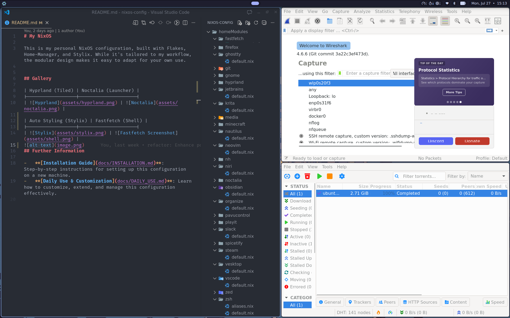
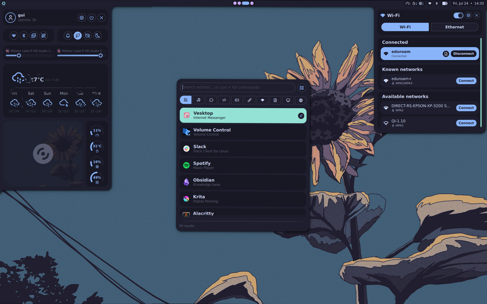
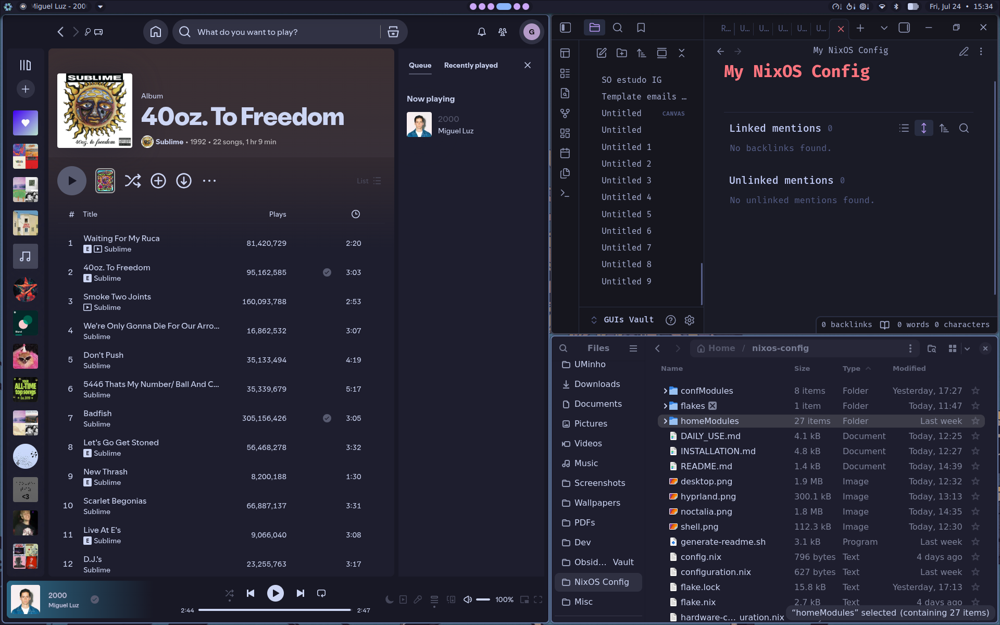
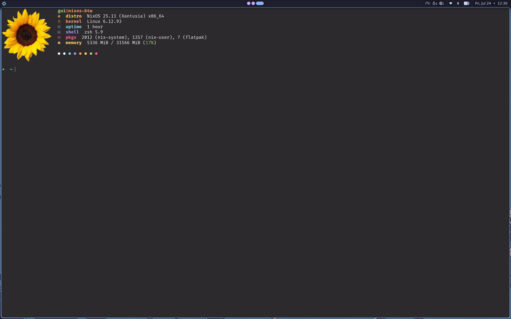

# My NixOS

This is my personal NixOS configuration, built with Flakes, Home-Manager, and Stylix. While it's tailored to my workflow, the modular design makes it easy to adapt for your own use.

## Gallery

| Hyprland (Tiled) | Noctalia (Launcher) |
|------------------|---------------------|
|  |  |

| Auto Styling (Stylix) | Fastfetch (Shell) |
|------------------|---------------------|
|  |  |

## Further Information

-   **[Installation Guide](docs/INSTALLATION.md)**: Step-by-step instructions for setting up this configuration on a new machine.
-   **[Daily Use & Customization](docs/DAILY_USE.md)**: Learn how to customize, extend, and manage this configuration effectively.
